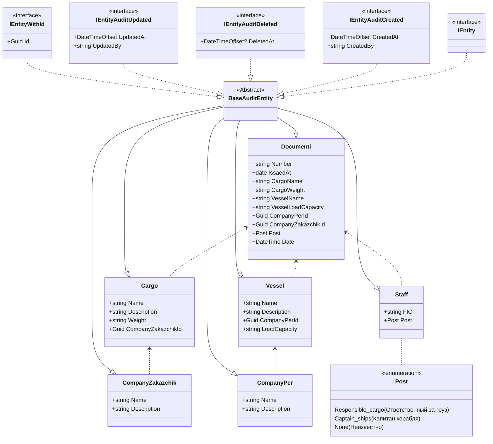

# Автоматизация погрузки судна
## Схема моделей

```mermaid
    classDiagram
    Documenti <.. Cargo
    Documenti <.. Vessel
    Documenti <.. Staff
    Cargo <.. CompanyZakazchik
    Vessel <..CompanyPer
    Staff .. Post
    BaseAuditEntity --|> Cargo
    BaseAuditEntity --|> Vessel
    BaseAuditEntity --|> Documenti
    BaseAuditEntity --|> CompanyZakazchik
    BaseAuditEntity --|> CompanyPer
    BaseAuditEntity --|> Staff
    IEntity ..|> BaseAuditEntity
    IEntityAuditCreated ..|> BaseAuditEntity
    IEntityAuditDeleted ..|> BaseAuditEntity
    IEntityAuditUpdated ..|> BaseAuditEntity
    IEntityWithId ..|> BaseAuditEntity
    class IEntity{
        <<interface>>
    }
    class IEntityAuditCreated{
        <<interface>>
        +DateTimeOffset CreatedAt
        +string CreatedBy
    }
    class IEntityAuditDeleted{
        <<interface>>
        +DateTimeOffset? DeletedAt
    }
    class IEntityAuditUpdated{
        <<interface>>
        +DateTimeOffset UpdatedAt
        +string UpdatedBy
    }
    class IEntityWithId{
        <<interface>>
        +Guid Id
    }        
    class Cargo{
        +string Name
        +string Description
        +string Weight
        +Guid CompanyZakazchikId
    }
    class CompanyPer{
        +string Name
        +string Description
    }
    class CompanyZakazchik {
        +string Name
        +string Description
    }
    class Vessel {
        +string Name
        +string Description
        +Guid CompanyPerId
        +string LoadCapacity
    }

    class Staff {
        +string FIO
        +Post Post
    }
    class Documenti {
        +string Number
        +date IssaedAt
        +string CargoName 
        +string CargoWeight
        +string VesselName
        +string VesselLoadCapacity
        +Guid CompanyPerId
        +Guid CompanyZakazchikId
        +Post Post
        +DateTime Date
    }
    class Post {
        <<enumeration>>
        Responsible_cargo(Ответственный за груз)
        Captain_ships(Капитан корабля )
        None(Неизвестно)
    }
    class BaseAuditEntity {
        <<Abstract>>        
    }
```

## Пример бизнес-процеса

## Запрос для БД

