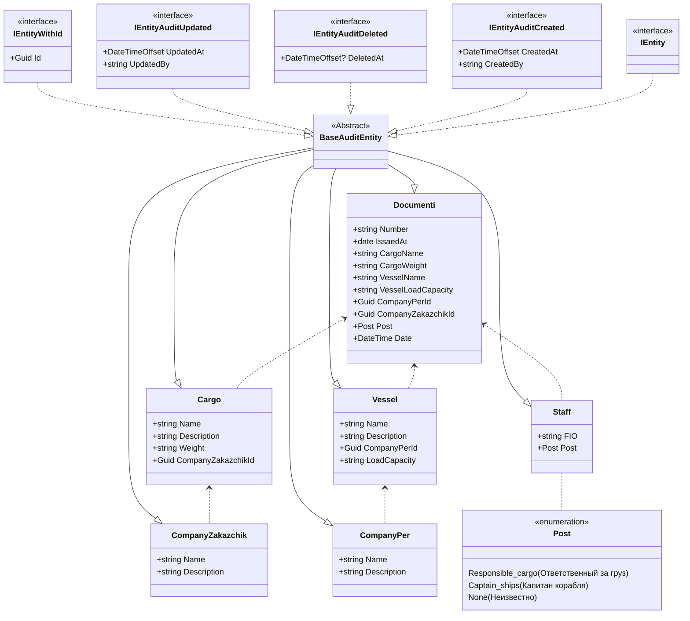

# Автоматизация погрузки судна
## Схема моделей

## Пример бизнес-процеса

## Запрос для БД
USE Port1

--Для таблицы "Компании перевозчики"
INSERT INTO dbo.CompanyPer(Id, CreatedAt, CreatedBy, UpdatedAt, UpdatedBy, Name, Description) VALUES
(NEWID(), GETDATE(),'PortKisel.Api',GETDATE(),'PortKisel.Api', 'TransOcean', 'Междуконтинентальная транспортная компания'),
(NEWID(), GETDATE(),'PortKisel.Api',GETDATE(),'PortKisel.Api', 'Балтиец', 'Балтийская транспортная компания'),
(NEWID(), GETDATE(),'PortKisel.Api',GETDATE(),'PortKisel.Api', 'Русич', 'Российская транспортная компания')

--Для таблицы "Компании заказчики"
INSERT INTO dbo.CompanyZakazchik(Id, CreatedAt, CreatedBy, UpdatedAt, UpdatedBy, Name, Description) VALUES
(NEWID(), GETDATE(),'PortKisel.Api',GETDATE(),'PortKisel.Api', 'Птица', 'Птицефабрика'),
(NEWID(), GETDATE(),'PortKisel.Api',GETDATE(),'PortKisel.Api', 'ЛАДА', 'Автомобильный завод лада'),
(NEWID(), GETDATE(),'PortKisel.Api',GETDATE(),'PortKisel.Api', 'Газпром', 'Нефтегазовая компания')

--Для таблицы "Работники"
INSERT INTO dbo.Staff(Id, CreatedAt, CreatedBy, UpdatedAt, UpdatedBy, FIO, Post) VALUES
(NEWID(), GETDATE(),'PortKisel.Api',GETDATE(),'PortKisel.Api', 'Зубенко Михаил Петрович', 1),
(NEWID(), GETDATE(),'PortKisel.Api',GETDATE(),'PortKisel.Api', 'Иванов Иван Иванович', 0),
(NEWID(), GETDATE(),'PortKisel.Api',GETDATE(),'PortKisel.Api', 'Селезнев Виктор Генадьевич', 2)

--Для таблицы "Судно"
INSERT INTO dbo.Vessel(Id, CreatedAt, CreatedBy, UpdatedAt, UpdatedBy, CompanyPerId, Name, LoadCapacity, Description) VALUES
(NEWID(), GETDATE(),'PortKisel.Api',GETDATE(),'PortKisel.Api',(SELECT Id FROM CompanyPer WHERE Name = 'Балтиец') ,'Народоволец', '12000', 'Легкое судно'),
(NEWID(), GETDATE(),'PortKisel.Api',GETDATE(),'PortKisel.Api',(SELECT Id FROM CompanyPer WHERE Name = 'TransOcean') ,'ICON OF THE SEAS', '20000', 'Среднее судно'),
(NEWID(), GETDATE(),'PortKisel.Api',GETDATE(),'PortKisel.Api',(SELECT Id FROM CompanyPer WHERE Name = 'Русич') ,'Адмирал Кузнецов', '50000', 'Огромное судно')

--Для таблицы "Грузы"
INSERT INTO dbo.Cargo(Id, CreatedAt, CreatedBy, UpdatedAt, UpdatedBy, CompanyZakazchikId, Name, Weight, Description) VALUES
(NEWID(), GETDATE(),'PortKisel.Api',GETDATE(),'PortKisel.Api',(SELECT Id FROM CompanyZakazchik WHERE Name = 'Газпром') ,'Сжатый газ', '25000', 'Требуется огромное судно!'),
(NEWID(), GETDATE(),'PortKisel.Api',GETDATE(),'PortKisel.Api',(SELECT Id FROM CompanyZakazchik WHERE Name = 'Птица') ,'Живой скот', '5000', 'Курицы'),
(NEWID(), GETDATE(),'PortKisel.Api',GETDATE(),'PortKisel.Api',(SELECT Id FROM CompanyZakazchik WHERE Name = 'ЛАДА') ,'Автомобили ЛАДА', '14000', 'ЛАДА ВЕСТА')

--Для таблицы "Документы"
INSERT INTO dbo.Documenti(Id, CreatedAt, CreatedBy, UpdatedAt, UpdatedBy, Number,IssaedAt, CargoId, VesselId, StaffId) VALUES
(NEWID(), GETDATE(),'PortKisel.Api',GETDATE(),'PortKisel.Api','190278', GETDATE(),(SELECT Id FROM Cargo WHERE Name = 'Сжатый газ'),(SELECT Id FROM Vessel WHERE Name = 'Адмирал Кузнецов'),(SELECT Id FROM Staff WHERE FIO = 'Иванов Иван Иванович')),
(NEWID(), GETDATE(),'PortKisel.Api',GETDATE(),'PortKisel.Api','190278', GETDATE(),(SELECT Id FROM Cargo WHERE Name = 'Автомобили ЛАДА'),(SELECT Id FROM Vessel WHERE Name = 'ICON OF THE SEAS'),(SELECT Id FROM Staff WHERE FIO = 'Селезнев Виктор Генадьевич')),
(NEWID(), GETDATE(),'PortKisel.Api',GETDATE(),'PortKisel.Api','190278', GETDATE(),(SELECT Id FROM Cargo WHERE Name = 'Живой скот'),(SELECT Id FROM Vessel WHERE Name = 'Народоволец'),(SELECT Id FROM Staff WHERE FIO = 'Зубенко Михаил Петрович'))
