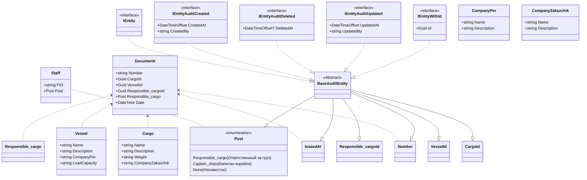

# Автоматизация погрузки судна
## Схема моделей

```mermaid
    classDiagram
    Documenti <.. Number
    Documenti <.. IssaedAt
    Documenti <.. Cargo
    Documenti <.. Vessel
    Documenti <.. Responsible_cargo
    Staff .. Post
    BaseAuditEntity --|> Number
    BaseAuditEntity --|> IssaedAt
    BaseAuditEntity --|> CargoId
    BaseAuditEntity --|> VesselId
    BaseAuditEntity --|> Responsible_cargoId
    BaseAuditEntity --|> Post
    IEntity ..|> BaseAuditEntity
    IEntityAuditCreated ..|> BaseAuditEntity
    IEntityAuditDeleted ..|> BaseAuditEntity
    IEntityAuditUpdated ..|> BaseAuditEntity
    IEntityWithId ..|> BaseAuditEntity
    class IEntity{
        <<interface>>
    }
    class IEntityAuditCreated{
        <<interface>>
        +DateTimeOffset CreatedAt
        +string CreatedBy
    }
    class IEntityAuditDeleted{
        <<interface>>
        +DateTimeOffset? DeletedAt
    }
    class IEntityAuditUpdated{
        <<interface>>
        +DateTimeOffset UpdatedAt
        +string UpdatedBy
    }
    class IEntityWithId{
        <<interface>>
        +Guid Id
    }        
    class Cargo{
        +string Name
        +string Description
        +string Weight
        +string CompanyZakazchik
    }
    class CompanyPer{
        +string Name
        +string Description
    }
    class CompanyZakazchik {
        +string Name
        +string Description
    }
    class Vessel {
        +string Name
        +string Description
        +string CompanyPer
        +string LoadCapacity
    }

    class Staff {
        +string FIO
        +Post Post
    }
    class Documenti {
        +string Number 
        +Guid CargoId 
        +Guid VesselId
        +Guid Responsible_cargoId
        +Post Responsible_cargo
        +DateTime Date
    }
    class Post {
        <<enumeration>>
        Responsible_cargo(Ответственный за груз)
        Captain_ships(Капитан корабля )
        None(Неизвестно)
    }
    class BaseAuditEntity {
        <<Abstract>>        
    }
```
